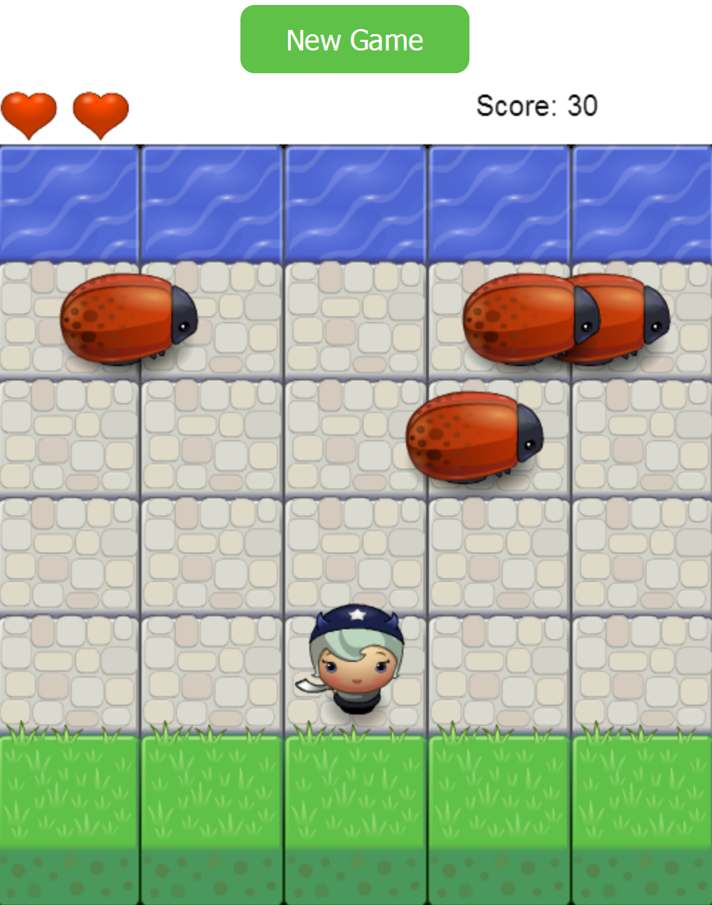

# Classic Arcade Game Clone

This is one of the projects for the Front-End Web Developer Nanodegree program at [Udacity](https://www.udacity.com/course/front-end-web-developer-nanodegree--nd001).
Using provided art assets and the game engine, I built my version of a classic Frogger arcade game where a player needs to navigate a character to the top of the screen while avoiding a collision with an enemy.
This project features newly acquired skills in Object Oriented JS and HTML5 Canvas.

#### Playing the game
The goal is simple, get a hero character to move across the gray bricks towards the water without getting hit by the swiftly moving enemy bugs. Each time a character reaches the water, the score increases by ten points and the character is reset back to the starting position.
A player is given 3 spare lives that are displayed in the upper left corner as red hearts. A heart is removed when a hero character collides with an enemy bug. When no hearts are left, Player loses and the game is reset. The goal is to accumulate 100 points before running out of hearts.

#### Movement and Controls
Navigate a hero character by using the main up/right/left/down arrow keys on the keyboard.

#### [PLAY GAME](https://sakela17.github.io/frontend-nanodegree-arcade-game/)
